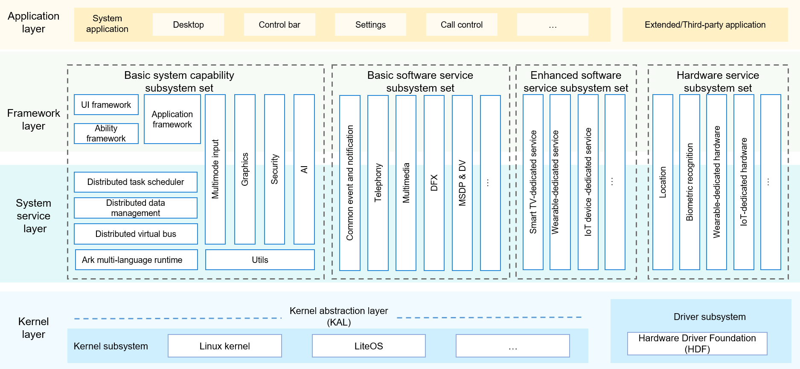

# OpenHaramonyOS Awesome
Read on web at: [https://osaholic.com/harmoryos-awesome](https://osaholic.com/harmoryos-awesome/)
### Architecture

### Official link
- [Homepage](https://developer.harmonyos.com/en/home/)
- [OpenHarmonyOS Sourcecode](https://gitee.com/openharmony)
- [HarmonyOS Overview](https://developer.harmonyos.com/en/docs/documentation/doc-guides/harmonyos-overview-0000000000011903)
### Links
- [Huawei LiteOS Kernel](https://liteos.github.io/en/kernel/#highlights-of-huawei-liteos-kernel)
### Events
- [HarmonyOS 2.0 Mobile Beta launch event set for December 16, 2020](https://osaholic.com/harmonyos-20-mobile-beta-launch-event-set-for-december-16-check-full-event-schedule/)
- [Summary News from Huawei Central - Event HarmonyOS 2.0 Beta developer conference on December 16, 2020](https://osaholic.com/summary-news-from-huawei-central-event-harmonyos-20-beta-developer-conference-on-december-16/)

### Devices
HarmonyOS 2.0 will support the type of memory devices:
- From September 10, 2020 – Device with 128KB to 128MB RAM
- From April 21, 2021 – Device with 128MB to 4GB RAM
- From October 2021 – Device with 4GB to more than 4GB RAM
### Videos
- [Eclipse 2020 CON - HarmonyOS: Key technical features and architectural deep dive](https://www.youtube.com/watch?v=G4l1a1HqjEI&feature=emb_logo&ab_channel=EclipseFoundation)
